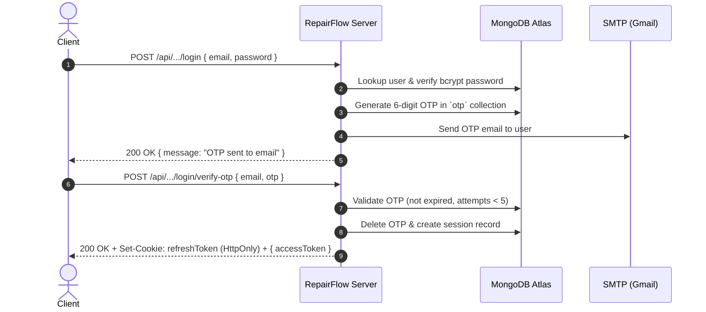

# RepairFlow Backend — Electronic Device Repair Shop Management System

> **NIBM 26.1P Agile Method Coursework — Group E**  
> A production-ready, enterprise-grade Node.js/Express REST API powering the RepairFlow platform. Features Zero-Trust Multi-Role Authentication, 6-Digit Email OTP verification, Idempotent Repair Intakes, Immutable Repair Estimates, and Role-Based Access Control for Customers, Technicians, and Owner/Staff.

---

## Table of Contents

1. [Architecture & Design Principles](#architecture--design-principles)
2. [Tech Stack](#tech-stack)
3. [Role-Based Access Control (RBAC)](#role-based-access-control-rbac)
4. [Environment Configuration (`.env`)](#environment-configuration-env)
5. [Prerequisites & Setup](#prerequisites--setup)
6. [Available NPM Scripts](#available-npm-scripts)
7. [Database Collections & Models](#database-collections--models)
8. [Authentication & Security Lifecycle](#authentication--security-lifecycle)
9. [Complete API Reference](#complete-api-reference)
   - [System Health](#1-system-health)
   - [Customer Authentication (`/api/auth`)](#2-customer-authentication-apiauth)
   - [Internal Shared Auth (`/api/internal/auth`)](#3-internal-shared-auth-apiinternalauth)
   - [Staff Portal & Technician Management (`/api/staff`)](#4-staff-portal--technician-management-apistaff)
   - [Technician Portal & Assigned Jobs (`/api/technician`)](#5-technician-portal--assigned-jobs-apitechnician)
   - [Estimates Alias (`/api/jobs`)](#6-estimates-alias-apijobs)
10. [SCRUM Story Implementation Map](#scrum-story-implementation-map)
11. [Postman Collection & Testing Guide](#postman-collection--testing-guide)
12. [Team Collaboration & Merging Guidelines](#team-collaboration--merging-guidelines)

---

## Architecture & Design Principles

The backend is built around clean layered architecture:

```
src/
├── config/             # Database (Mongoose 9) & connection tuning
├── controllers/        # Express route request/response handlers
├── middlewares/        # JWT auth, RBAC, Rate Limiters, Idempotency & Error handlers
├── models/             # Mongoose schemas, business rules, indexes, hooks
├── repositories/       # Isolated data access layer
├── routes/             # Express routers mapped to functional domains
├── services/           # Core domain logic, email dispatch, OTP validation, crypto
└── utils/              # Currency/minor units conversion, ID generators, hashers
```

- **Domain Isolation**: Customer flows, Staff administrative actions, and Technician workflows have distinct controllers and routes while sharing reusable core services.
- **Strict Data Access Isolation**: Technicians can only view jobs explicitly assigned to their user ID (HTTP 403 denied if requesting an unassigned job).
- **Two-Factor / Email OTP Verification**: Every sensitive action (registration, login, password reset, technician onboarding) is secured via 6-digit time-based OTP sent through SMTP.
- **Idempotency & Immutability**: Repair job intakes support client-provided `Idempotency-Key` headers to prevent duplicate device creation on network retries. Repair estimates are strictly versioned, immutable, and computed in integer minor units (LKR cents) to eliminate floating-point rounding errors.

---

## Tech Stack

| Technology | Purpose |
| :--- | :--- |
| **Node.js** (v20+ / v24 tested) | Non-blocking runtime environment |
| **Express 5.x** | Modern web application framework |
| **MongoDB Atlas & Mongoose 9.x** | Distributed cloud document database & object modeling |
| **JWT (`jsonwebtoken`)** | Short-lived Access Tokens (15m) + Long-lived Refresh Tokens (7d) |
| **Bcrypt.js** | 12-round salted password hashing |
| **Nodemailer** | SMTP email transporter for real-time OTP delivery |
| **Express Rate Limit** | Brute-force & DDoS protection on auth/OTP endpoints |
| **Helmet** | HTTP security header hardening |
| **CORS** | Cross-Origin Resource Sharing with credential support |

---

## Role-Based Access Control (RBAC)

The application enforces three distinct system roles:

| Role | Purpose | Creation Mechanism | Capabilities |
| :--- | :--- | :--- | :--- |
| `customer` | Device Owners | Public self-registration (`/api/auth/register`) | Register, verify email, track own repairs |
| `owner_staff` | Shop Owners / Front Desk Staff | Single-account setup with `OWNER_SETUP_KEY` | Register repair intakes, create & verify technicians, toggle technician status, issue estimates |
| `technician` | Repair Engineers | Created only by `owner_staff` (`/api/staff/technicians`) | View assigned repair jobs (SCRUM-41), inspect device faults, record diagnoses |

> **Single Owner Constraint**: A MongoDB partial unique index ensures only **one** `owner_staff` account can ever exist in the database.

---

## Environment Configuration (`.env`)

Create a `.env` file in the project root with the following parameters:

```ini
# Server Settings
PORT=5000
NODE_ENV=development

# Database Connection (MongoDB Atlas)
MONGO_URI=mongodb+srv://<username>:<password>@<cluster>.mongodb.net/?retryWrites=true&w=majority
MONGO_DB_NAME=repairflow

# JWT Token Secrets
JWT_SECRET=super_secret_jwt_access_key_replace_in_production
REFRESH_TOKEN_SECRET=super_secret_jwt_refresh_key_replace_in_production
ACCESS_TOKEN_EXPIRES_IN=15m
REFRESH_TOKEN_EXPIRES_IN=7d

# Initial Setup
OWNER_SETUP_KEY=your_secure_owner_setup_key_here

# SMTP / Email Configuration (Gmail App Password)
EMAIL_SERVICE=gmail
EMAIL_USER=your_email@gmail.com
EMAIL_PASS=your_16_character_app_password
EMAIL_FROM="RepairFlow <your_email@gmail.com>"

# OTP Policy
OTP_EXPIRES_MINUTES=10
OTP_RESEND_COOLDOWN_SECONDS=60

# CORS & Cookies
CORS_ORIGIN=http://localhost:5173
AUTH_COOKIE_SECURE=false
AUTH_COOKIE_SAME_SITE=lax
```

---

## Prerequisites & Setup

### 1. Prerequisites
- **Node.js**: v20.19.0 or higher (Node 24 recommended)
- **NPM**: v10+
- **MongoDB Atlas**: Cluster URI with read/write credentials
- **Gmail Account**: With **2-Step Verification** enabled and a generated **App Password** for SMTP.

### 2. Installation
```bash
git clone <repository-url>
cd nibm261pgroupE_Backend
npm install
```

### 3. Verify Email & SMTP Settings
Ensure your credentials can authenticate with the Gmail SMTP server:
```bash
npm run email:check
```

### 4. Synchronize Database Indexes
Ensure all unique constraints (email, job reference, idempotency keys, single owner-staff) are created:
```bash
npm run db:sync-indexes
```

### 5. Start Development Server
```bash
npm run dev
```
The server will boot on `http://localhost:5000`.

---

## Available NPM Scripts

| Script | Command | Purpose |
| :--- | :--- | :--- |
| `npm run dev` | `nodemon src/server.js` | Starts server with live auto-reload |
| `npm start` | `node src/server.js` | Starts server in production mode |
| `npm run check` | `node --check ...` | Fast syntax check of all models, controllers, services & routes |
| `npm run db:sync-indexes` | `node scripts/syncIndexes.js` | Connects to Mongo Atlas and syncs all indexes |
| `npm run email:check` | `node scripts/checkEmailConfig.js` | Tests SMTP connection using `.env` credentials |
| `npm run estimate:test-data` | `node scripts/prepareEstimateTestData.js <jobId>` | Prepares a test diagnosis for an existing job (SCRUM-14 testing) |

---

## Database Collections & Models

### 1. `users`
- Stores user accounts for `customer`, `owner_staff`, and `technician`.
- Password hashed with 12-round bcrypt.
- Active session array with hashed refresh tokens for multi-device revocation.
- Partial unique index: `{ role: 1 }` where `{ role: 'owner_staff' }` guarantees exactly one owner.

### 2. `otp`
- Ephemeral store for 6-digit numerical codes.
- Scoped by `email`, `purpose` (`REGISTRATION`, `LOGIN`, `FORGOT_PASSWORD`, `TECHNICIAN_ACTIVATION`, `OWNER_SETUP`).
- Includes auto-expiring TTL index (10 minutes), attempt tracker (max 5 tries), and resend counter (max 5 resends).

### 3. `repair_jobs`
- Represents electronic device repair intakes.
- **`reference`**: Unique formatted reference `JOB-YYYYMM-XXXX` (e.g. `JOB-202609-0001`).
- **`customer`**: ObjectId ref to `User`.
- **`customerSnapshot`**: Immutable snapshot of name, email, contact at intake time.
- **`deviceType`**, **`makeModel`**, **`serialNumber`**, **`reportedFault`**: Device intake specifications.
- **`status`**: State machine (`Received`, `Diagnosing`, `Awaiting Approval`, `Approved`, `In Repair`, `Waiting for Parts`, `Ready for Collection`, `Ready for Return`, `Collected`).
- **`assignedTechnician`** *(SCRUM-41)*: ObjectId ref to `User` (technician).
- **`currentEstimate`** *(SCRUM-14)*: ObjectId ref to latest issued `Estimate`.
- **`revision`**: Optimistic concurrency counter.
- **`idempotencyKey`** & **`requestHash`**: Enforces idempotent intake submissions.

### 4. `estimates` & `estimate_items`
- Represents immutable versioned repair estimates.
- Prices stored in `minorUnits` (e.g., LKR 4500.00 = `450000`) to prevent IEEE 754 floating-point errors.
- Version 1 is immutable once issued; moves job status to `Awaiting Approval`.

---

## Authentication & Security Lifecycle



- **Dual-Token System**:
  - `accessToken`: Short-lived (15 minutes), passed in `Authorization: Bearer <token>` header.
  - `refreshToken`: Long-lived (7 days), stored in an `HttpOnly`, `SameSite=Lax` cookie and hashed in MongoDB.
- **Session Rotation**: Calling `/refresh-token` rotates both tokens and invalidates the previous refresh token.
- **Logout**: Immediately deletes the server-side session hash and clears the client cookie.

---

## Complete API Reference

### 1. System Health

| Method | Endpoint | Auth | Description |
| :--- | :--- | :--- | :--- |
| `GET` | `/api/health` | Public | System status and service health check |

---

### 2. Customer Authentication (`/api/auth`)

| Method | Endpoint | Auth | Description |
| :--- | :--- | :--- | :--- |
| `POST` | `/api/auth/register` | Public (Rate-limited) | Register customer account; triggers verification OTP |
| `POST` | `/api/auth/register/verify-otp` | Public | Verify OTP and activate customer account |
| `POST` | `/api/auth/register/resend-otp` | Public | Resend registration OTP (60s cooldown) |
| `POST` | `/api/auth/login` | Public (Rate-limited) | Verify credentials; triggers login OTP |
| `POST` | `/api/auth/login/verify-otp` | Public | Verify login OTP; sets refresh cookie and returns access token |
| `POST` | `/api/auth/login/resend-otp` | Public | Resend login OTP |
| `POST` | `/api/auth/forgot-password/initiate`| Public | Initiate password reset; sends OTP to email |
| `POST` | `/api/auth/forgot-password/verify-otp`| Public | Verify reset OTP; returns short-lived reset token |
| `POST` | `/api/auth/forgot-password/resend-otp`| Public | Resend reset OTP |
| `POST` | `/api/auth/forgot-password/change`| Public | Change password using reset token |
| `POST` | `/api/auth/refresh-token` | Cookie | Rotate refresh token and get fresh access token |
| `POST` | `/api/auth/logout` | Authenticated | Revoke session and clear cookies |
| `GET` | `/api/auth/me` | Bearer (`customer`) | Get currently logged-in customer profile |

---

### 3. Internal Shared Auth (`/api/internal/auth`)

Auto-detects whether the user is `owner_staff` or `technician` from their email. The frontend does not need a role selector.

| Method | Endpoint | Auth | Description |
| :--- | :--- | :--- | :--- |
| `POST` | `/api/internal/auth/login` | Public | Password check; triggers OTP |
| `POST` | `/api/internal/auth/login/verify-otp` | Public | Verifies OTP; issues role-based JWT |
| `POST` | `/api/internal/auth/login/resend-otp` | Public | Resends login OTP |
| `POST` | `/api/internal/auth/forgot-password/*` | Public | Password reset endpoints for internal users |
| `POST` | `/api/internal/auth/refresh-token` | Cookie | Session refresh |
| `POST` | `/api/internal/auth/logout` | Authenticated | Session logout |
| `GET` | `/api/internal/auth/me` | Bearer (`owner_staff` or `technician`) | Returns authenticated internal user profile |

---

### 4. Staff Portal & Technician Management (`/api/staff`)

#### Initial System Setup
| Method | Endpoint | Header Required | Description |
| :--- | :--- | :--- | :--- |
| `POST` | `/api/staff/auth/setup` | `x-owner-setup-key: <OWNER_SETUP_KEY>` | Creates the one-time Owner/Staff account; sends setup OTP |
| `POST` | `/api/staff/auth/setup/verify-otp` | None | Verifies setup OTP and activates Owner/Staff account |
| `POST` | `/api/staff/auth/setup/resend-otp` | None | Resends setup OTP |

#### Staff Authentication
Endpoints mirror `/api/internal/auth` under the `/api/staff/auth/*` path.
`GET /api/staff/auth/me` is restricted to `owner_staff`.

#### Technician Management (SCRUM-44 & SCRUM-45)
| Method | Endpoint | Auth | Description |
| :--- | :--- | :--- | :--- |
| `POST` | `/api/staff/technicians` | Bearer (`owner_staff`) | Create technician account; sends activation OTP to technician's email |
| `POST` | `/api/staff/technicians/verify-otp` | Bearer (`owner_staff`) | Staff enters OTP to verify & activate technician account |
| `POST` | `/api/staff/technicians/resend-otp` | Bearer (`owner_staff`) | Resend technician activation OTP |
| `GET` | `/api/staff/technicians` | Bearer (`owner_staff`) | List all technicians with active status |
| `PATCH` | `/api/staff/technicians/:id/toggle-active` | Bearer (`owner_staff`) | Toggle technician `isActive` state (active/inactive) |

#### Repair Job Intake (SCRUM-9)
| Method | Endpoint | Auth | Headers | Description |
| :--- | :--- | :--- | :--- | :--- |
| `GET` | `/api/staff/customers` | Bearer (`owner_staff`) | None | Search active verified customers (`?query=john&limit=10`) |
| `POST` | `/api/staff/jobs` | Bearer (`owner_staff`) | `Idempotency-Key: <unique-uuid>` | Register new device intake |

*Sample Intake Request Body:*
```json
{
  "customerId": "660c1234abcd...",
  "deviceType": "Smartphone",
  "makeModel": "Samsung Galaxy S22",
  "serialNumber": "SN-987654321",
  "reportedFault": "Screen cracked, touch unresponsive, battery drains quickly"
}
```

#### Repair Estimates (SCRUM-14)
| Method | Endpoint | Auth | Description |
| :--- | :--- | :--- | :--- |
| `GET` | `/api/staff/jobs/:jobIdentifier/estimate-context` | Bearer (`owner_staff`) | Inspect intake, completed diagnosis, and version-1 eligibility |
| `POST` | `/api/staff/jobs/:jobIdentifier/estimates` | Bearer (`owner_staff`) | Issue initial immutable estimate; moves job to `Awaiting Approval` |

*Sample Estimate Request Body:*
```json
{
  "items": [
    {
      "type": "PART",
      "description": "Original AMOLED Display Panel",
      "quantity": 1,
      "unitPrice": "24500.00"
    },
    {
      "type": "LABOUR",
      "description": "Display Replacement & Calibration Labour",
      "quantity": 1,
      "unitPrice": "4500.00"
    }
  ]
}
```

---

### 5. Technician Portal & Assigned Jobs (`/api/technician`)

#### Technician Auth
Endpoints under `/api/technician/auth/*` handle technician login, OTP verification, password reset, and session management.

#### Assigned Repair Jobs (SCRUM-41)
| Method | Endpoint | Auth | Description |
| :--- | :--- | :--- | :--- |
| `GET` | `/api/technician/jobs` | Bearer (`technician`) | Lists all repair jobs assigned to the authenticated technician |
| `GET` | `/api/technician/jobs/:jobIdentifier` | Bearer (`technician`) | Fetches full technical details for an assigned job (`_id` or reference) |

*Features & Security:*
- **Zero Data Leakage**: Requesting a job assigned to another technician responds with `403 Forbidden` (`ACCESS_DENIED`) without exposing job or customer details.
- **Empty State**: Technicians with no assigned jobs receive `200 OK` with `{ count: 0, jobs: [] }`.
- **Search by Identifier**: `jobIdentifier` accepts either MongoDB `_id` (e.g. `67...`) or human reference (e.g. `JOB-202609-0001`).

---

### 6. Estimates Alias (`/api/jobs`)

| Method | Endpoint | Auth | Description |
| :--- | :--- | :--- | :--- |
| `POST` | `/api/jobs/:jobIdentifier/estimates` | Bearer (`owner_staff`) | Jira-compatible endpoint alias for SCRUM-14 estimate issuance |

---

## SCRUM Story Implementation Map

| Story ID | Title | Implementation Details |
| :--- | :--- | :--- |
| **SCRUM-9** | Repair Job Registration | Intake endpoint `POST /api/staff/jobs`, idempotent replay protection via `Idempotency-Key`, auto-generated reference `JOB-YYYYMM-XXXX`, initial `Received` status. |
| **SCRUM-14** | Issue Initial Repair Estimate | `POST /api/staff/jobs/:id/estimates` and `/api/jobs/:id/estimates`, checks completed diagnosis prerequisite, immutable versioning, minor-unit money arithmetic. |
| **SCRUM-32** | Customer Registration & Email Verification | Public self-registration, 6-digit OTP verification, prevents duplicate active emails. |
| **SCRUM-33** | Customer Search & Contact Number Indexing | Database index on `contactNumber`, search API for staff intake form (`GET /api/staff/customers`). |
| **SCRUM-36** | Two-Factor OTP & Password Reset | Time-bounded OTP with brute-force lockout (max 5 tries), resend cooldown (60s), secure password reset tokens. |
| **SCRUM-41** | Technician View Assigned Repair Jobs | `GET /api/technician/jobs` and `GET /api/technician/jobs/:jobIdentifier`, strict ownership enforcement (403 for other techs' jobs), informative empty state. |
| **SCRUM-44** | Staff-Guided Technician Onboarding | Owner/Staff creates technicians, verifies OTP directly from Staff Portal, sets initial password. |
| **SCRUM-45** | Technician Active/Inactive Management | `PATCH /api/staff/technicians/:id/toggle-active`, immediately prevents deactivated technicians from logging in or refreshing tokens. |

---

## Postman Collection & Testing Guide

The repository includes a complete Postman collection ready for testing:
`RepairFlow Backend.postman_collection.json`

### 1. Import the Collection
1. Open Postman.
2. Click **Import** and select `RepairFlow Backend.postman_collection.json`.
3. Select the collection **RepairFlow Backend** and open the **Variables** tab.

### 2. Configure Collection Variables
Set the initial/current values for:
- `baseUrl`: `http://localhost:5000`
- `testEmail`: A real email inbox you have access to (to receive OTPs).
- `ownerSetupKey`: Value matching `OWNER_SETUP_KEY` in your `.env`.

### 3. Collection Structure (15 Folders)
1. `Health` — System health check
2. `Customer Authentication` — Register, verify OTP, login, forgot password, me
3. `Staff Setup & Authentication` — One-time setup, login, forgot password, me
4. `Technician Activation & Authentication` — Login, forgot password, me
5. `Shared Internal Authentication` — Auto role-detect login, logout
6. `Staff - Customer Lookup (SCRUM-9 / SCRUM-33)` — Search customers
7. `Staff - Repair Job Registration (SCRUM-9)` — Create intake, test idempotency
8. `Staff - Estimate Context & Issue (SCRUM-14)` — Estimate context and issuance
9. `Jobs - Estimate Issue Alias (SCRUM-14 Jira Route)` — Jira alias test
10. `Staff - Technician Management (SCRUM-44 / SCRUM-45)` — Create tech, verify OTP, toggle active
11. `Technician - Assigned Jobs (SCRUM-41)` — **New**: List my jobs, get job details, 403 authorization check
12. `Session Management (Refresh Token)` — Test token rotation & logout

### 4. Testing SCRUM-41 (Technician Assigned Jobs)
1. Run **Technician Login** or use an existing technician token.
2. Call `GET /api/technician/jobs`:
   - If no jobs are assigned: returns `200 OK` with `{ count: 0, jobs: [] }` (Acceptance criteria: informative empty state).
3. In MongoDB Compass or Atlas, set `assignedTechnician` on a test job to your technician's `_id`.
4. Call `GET /api/technician/jobs`: returns the assigned job with reference, deviceType, reportedFault, and status.
5. Call `GET /api/technician/jobs/JOB-YYYYMM-XXXX`: returns full technical details.
6. Call `GET /api/technician/jobs/:unassignedJobId`: returns `403 Forbidden` (`ACCESS_DENIED`).

---

## Team Collaboration & Merging Guidelines

When merging branches or integrating new modules into `RepairFlow Backend`:

1. **Preserve Model Fields**:
   - `src/models/RepairJob.js` contains:
     - `assignedTechnician` (SCRUM-41)
     - `currentEstimate` (SCRUM-14)
     - `revision` (SCRUM-14 optimistic locking)
     - `idempotencyKey` & `requestHash` (SCRUM-9)
   - *Do not overwrite these fields when merging other job stories!*

2. **Diagnosis Integration (SCRUM-13)**:
   - When SCRUM-13 is merged, ensure the `diagnoses` collection preserves:
     - `job` (ObjectId ref to `RepairJob`)
     - `completedAt` (Date)
     - `findings`, `recommendedWork`, `publicSummary` (Strings)

3. **Database Indexes**:
   - Always run `npm run db:sync-indexes` after pulling master/main branch updates to ensure all unique indexes are synchronized in MongoDB Atlas.

4. **Syntax Validation**:
   - Run `npm run check` before committing any code changes to confirm there are no syntax errors across all files.

---

### Coursework Details
- **Module**: Agile Methods (NIBM 3rd Year)
- **Batch**: 26.1P — Group E
- **System**: RepairFlow — Electronic Device Repair Shop Management System
