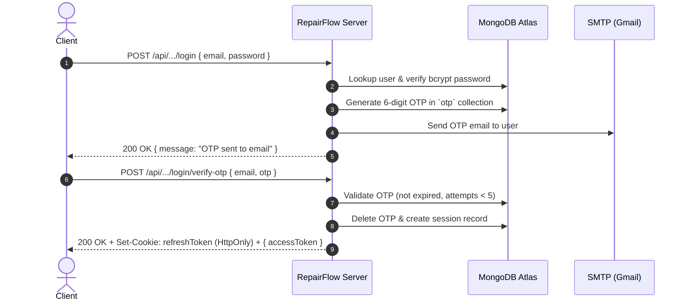

# RepairFlow Backend — Electronic Device Repair Shop Management System

> **NIBM 26.1P Agile Method Coursework — Group E**  
> A production-ready, enterprise-grade Node.js/Express REST API powering the RepairFlow platform. Features Zero-Trust Multi-Role Authentication, 6-Digit Email OTP verification, Idempotent Repair Intakes, Immutable Repair Estimates, and Role-Based Access Control for Customers, Technicians, and Owner/Staff.

---

## Table of Contents

1. [Architecture & Design Principles](#architecture--design-principles)
2. [Tech Stack](#tech-stack)
3. [Role-Based Access Control (RBAC)](#role-based-access-control-rbac)
4. [Environment Configuration (`.env`)](#environment-configuration-env)
5. [Prerequisites & Setup](#prerequisites--setup)
6. [Available NPM Scripts](#available-npm-scripts)
7. [Database Collections & Models](#database-collections--models)
8. [Authentication & Security Lifecycle](#authentication--security-lifecycle)
9. [Complete API Reference](#complete-api-reference)
   - [System Health](#1-system-health)
   - [Customer Authentication (`/api/auth`)](#2-customer-authentication-apiauth)
   - [Internal Shared Auth (`/api/internal/auth`)](#3-internal-shared-auth-apiinternalauth)
   - [Staff Portal & Technician Management (`/api/staff`)](#4-staff-portal--technician-management-apistaff)
   - [Technician Portal & Assigned Jobs (`/api/technician`)](#5-technician-portal--assigned-jobs-apitechnician)
   - [Estimates Alias (`/api/jobs`)](#6-estimates-alias-apijobs)
   - [Customer Public Repair Tracking (`/api/customer/jobs/:id/track`) — SCRUM-109](#7-customer-public-repair-tracking-scrum-109)
   - [Staff Customer Device Handover (`/api/staff/jobs/:id/handover`) — SCRUM-120](#8-staff-customer-device-handover-scrum-120)
   - [Customer Completed Repair Records & History (`/api/customer/jobs/history`) — SCRUM-125](#9-customer-completed-repair-records--history-scrum-125)
10. [SCRUM Story Implementation Map](#scrum-story-implementation-map)
11. [Postman Collection & Testing Guide](#postman-collection--testing-guide)
12. [Team Collaboration & Merging Guidelines](#team-collaboration--merging-guidelines)

---

## Architecture & Design Principles

The backend is built around clean layered architecture:

```
src/
├── config/             # Database (Mongoose 9) & connection tuning
├── controllers/        # Express route request/response handlers
├── middlewares/        # JWT auth, RBAC, Rate Limiters, Idempotency & Error handlers
├── models/             # Mongoose schemas, business rules, indexes, hooks
├── repositories/       # Isolated data access layer
├── routes/             # Express routers mapped to functional domains
├── services/           # Core domain logic, email dispatch, OTP validation, crypto
└── utils/              # Currency/minor units conversion, ID generators, hashers
```

- **Domain Isolation**: Customer flows, Staff administrative actions, and Technician workflows have distinct controllers and routes while sharing reusable core services.
- **Strict Data Access Isolation**: Technicians can only view jobs explicitly assigned to their user ID (HTTP 403 denied if requesting an unassigned job).
- **Two-Factor / Email OTP Verification**: Every sensitive action (registration, login, password reset, technician onboarding) is secured via 6-digit time-based OTP sent through SMTP.
- **Idempotency & Immutability**: Repair job intakes support client-provided `Idempotency-Key` headers to prevent duplicate device creation on network retries. Repair estimates are strictly versioned, immutable, and computed in integer minor units (LKR cents) to eliminate floating-point rounding errors.

---

## Tech Stack

| Technology | Purpose |
| :--- | :--- |
| **Node.js** (v20+ / v24 tested) | Non-blocking runtime environment |
| **Express 5.x** | Modern web application framework |
| **MongoDB Atlas & Mongoose 9.x** | Distributed cloud document database & object modeling |
| **JWT (`jsonwebtoken`)** | Short-lived Access Tokens (15m) + Long-lived Refresh Tokens (7d) |
| **Bcrypt.js** | 12-round salted password hashing |
| **Nodemailer** | SMTP email transporter for real-time OTP delivery |
| **Express Rate Limit** | Brute-force & DDoS protection on auth/OTP endpoints |
| **Helmet** | HTTP security header hardening |
| **CORS** | Cross-Origin Resource Sharing with credential support |

---

## Role-Based Access Control (RBAC)

The application enforces three distinct system roles:

| Role | Purpose | Creation Mechanism | Capabilities |
| :--- | :--- | :--- | :--- |
| `customer` | Device Owners | Public self-registration (`/api/auth/register`) | Register, verify email, track own repairs |
| `owner_staff` | Shop Owners / Front Desk Staff | Single-account setup with `OWNER_SETUP_KEY` | Register repair intakes, create & verify technicians, toggle technician status, issue estimates |
| `technician` | Repair Engineers | Created only by `owner_staff` (`/api/staff/technicians`) | View assigned repair jobs (SCRUM-41), inspect device faults, record diagnoses |

> **Single Owner Constraint**: A MongoDB partial unique index ensures only **one** `owner_staff` account can ever exist in the database.

---

## Environment Configuration (`.env`)

Create a `.env` file in the project root with the following parameters:

```ini
# Server Settings
PORT=5000
NODE_ENV=development

# Database Connection (MongoDB Atlas)
MONGO_URI=mongodb+srv://<username>:<password>@<cluster>.mongodb.net/?retryWrites=true&w=majority
MONGO_DB_NAME=repairflow

# JWT Token Secrets
JWT_SECRET=super_secret_jwt_access_key_replace_in_production
REFRESH_TOKEN_SECRET=super_secret_jwt_refresh_key_replace_in_production
ACCESS_TOKEN_EXPIRES_IN=15m
REFRESH_TOKEN_EXPIRES_IN=7d

# Initial Setup
OWNER_SETUP_KEY=your_secure_owner_setup_key_here

# SMTP / Email Configuration (Gmail App Password)
EMAIL_SERVICE=gmail
EMAIL_USER=your_email@gmail.com
EMAIL_PASS=your_16_character_app_password
EMAIL_FROM="RepairFlow <your_email@gmail.com>"

# OTP Policy
OTP_EXPIRES_MINUTES=10
OTP_RESEND_COOLDOWN_SECONDS=60

# CORS & Cookies
CORS_ORIGIN=http://localhost:5173
AUTH_COOKIE_SECURE=false
AUTH_COOKIE_SAME_SITE=lax
```

---

## Prerequisites & Setup

### 1. Prerequisites
- **Node.js**: v20.19.0 or higher (Node 24 recommended)
- **NPM**: v10+
- **MongoDB Atlas**: Cluster URI with read/write credentials
- **Gmail Account**: With **2-Step Verification** enabled and a generated **App Password** for SMTP.

### 2. Installation
```bash
git clone <repository-url>
cd nibm261pgroupE_Backend
npm install
```

### 3. Verify Email & SMTP Settings
Ensure your credentials can authenticate with the Gmail SMTP server:
```bash
npm run email:check
```

### 4. Synchronize Database Indexes
Ensure all unique constraints (email, job reference, idempotency keys, single owner-staff) are created:
```bash
npm run db:sync-indexes
```

### 5. Start Development Server
```bash
npm run dev
```
The server will boot on `http://localhost:5000`.

---

## Available NPM Scripts

| Script | Command | Purpose |
| :--- | :--- | :--- |
| `npm run dev` | `nodemon src/server.js` | Starts server with live auto-reload |
| `npm start` | `node src/server.js` | Starts server in production mode |
| `npm run check` | `node --check ...` | Fast syntax check of all models, controllers, services & routes |
| `npm run db:sync-indexes` | `node scripts/syncIndexes.js` | Connects to Mongo Atlas and syncs all indexes |
| `npm run email:check` | `node scripts/checkEmailConfig.js` | Tests SMTP connection using `.env` credentials |
| `npm run estimate:test-data` | `node scripts/prepareEstimateTestData.js <jobId>` | Prepares a test diagnosis for an existing job (SCRUM-14 testing) |
| `npm run handover:test` | `node scripts/testDeviceHandover.js` | Runs automated test suite for SCRUM-120 Customer Device Handover & Immutability |
| `npm run history:test` | `node scripts/testCustomerCompletedHistory.js` | Runs automated test suite for SCRUM-125 Customer Completed Repair Records & History |

---

## Database Collections & Models

### 1. `users`
- Stores user accounts for `customer`, `owner_staff`, and `technician`.
- Password hashed with 12-round bcrypt.
- Active session array with hashed refresh tokens for multi-device revocation.
- Partial unique index: `{ role: 1 }` where `{ role: 'owner_staff' }` guarantees exactly one owner.

### 2. `otp`
- Ephemeral store for 6-digit numerical codes.
- Scoped by `email`, `purpose` (`REGISTRATION`, `LOGIN`, `FORGOT_PASSWORD`, `TECHNICIAN_ACTIVATION`, `OWNER_SETUP`).
- Includes auto-expiring TTL index (10 minutes), attempt tracker (max 5 tries), and resend counter (max 5 resends).

### 3. `repair_jobs`
- Represents electronic device repair intakes.
- **`reference`**: Unique formatted reference `JOB-YYYYMM-XXXX` (e.g. `JOB-202609-0001`).
- **`customer`**: ObjectId ref to `User`.
- **`customerSnapshot`**: Immutable snapshot of name, email, contact at intake time.
- **`deviceType`**, **`makeModel`**, **`serialNumber`**, **`reportedFault`**: Device intake specifications.
- **`status`**: State machine (`Received`, `Diagnosing`, `Awaiting Approval`, `Approved`, `In Repair`, `Waiting for Parts`, `Ready for Collection`, `Ready for Return`, `Collected`).
- **`assignedTechnician`** *(SCRUM-41)*: ObjectId ref to `User` (technician).
- **`currentEstimate`** *(SCRUM-14)*: ObjectId ref to latest issued `Estimate`.
- **`revision`**: Optimistic concurrency counter.
- **`idempotencyKey`** & **`requestHash`**: Enforces idempotent intake submissions.

### 4. `estimates` & `estimate_items`
- Represents immutable versioned repair estimates.
- Prices stored in `minorUnits` (e.g., LKR 4500.00 = `450000`) to prevent IEEE 754 floating-point errors.
- Version 1 is immutable once issued; moves job status to `Awaiting Approval`.

---

## Authentication & Security Lifecycle


```mermaid
sequenceDiagram
    autonumber
    actor Client
    participant API as RepairFlow Server
    participant DB as MongoDB Atlas
    participant Mail as SMTP (Gmail)

    Client->>API: POST /api/.../login { email, password }
    API->>DB: Lookup user & verify bcrypt password
    API->>DB: Generate 6-digit OTP in `otp` collection
    API->>Mail: Send OTP email to user
    API-->>Client: 200 OK { message: "OTP sent to email" }

    Client->>API: POST /api/.../login/verify-otp { email, otp }
    API->>DB: Validate OTP (not expired, attempts < 5)
    API->>DB: Delete OTP & create session record
    API-->>Client: 200 OK + Set-Cookie: refreshToken (HttpOnly) + { accessToken }
```

- **Dual-Token System**:
  - `accessToken`: Short-lived (15 minutes), passed in `Authorization: Bearer <token>` header.
  - `refreshToken`: Long-lived (7 days), stored in an `HttpOnly`, `SameSite=Lax` cookie and hashed in MongoDB.
- **Session Rotation**: Calling `/refresh-token` rotates both tokens and invalidates the previous refresh token.
- **Logout**: Immediately deletes the server-side session hash and clears the client cookie.

---

## Complete API Reference

### 1. System Health

| Method | Endpoint | Auth | Description |
| :--- | :--- | :--- | :--- |
| `GET` | `/api/health` | Public | System status and service health check |

---

### 2. Customer Authentication (`/api/auth`)

| Method | Endpoint | Auth | Description |
| :--- | :--- | :--- | :--- |
| `POST` | `/api/auth/register` | Public (Rate-limited) | Register customer account; triggers verification OTP |
| `POST` | `/api/auth/register/verify-otp` | Public | Verify OTP and activate customer account |
| `POST` | `/api/auth/register/resend-otp` | Public | Resend registration OTP (60s cooldown) |
| `POST` | `/api/auth/login` | Public (Rate-limited) | Verify credentials; triggers login OTP |
| `POST` | `/api/auth/login/verify-otp` | Public | Verify login OTP; sets refresh cookie and returns access token |
| `POST` | `/api/auth/login/resend-otp` | Public | Resend login OTP |
| `POST` | `/api/auth/forgot-password/initiate`| Public | Initiate password reset; sends OTP to email |
| `POST` | `/api/auth/forgot-password/verify-otp`| Public | Verify reset OTP; returns short-lived reset token |
| `POST` | `/api/auth/forgot-password/resend-otp`| Public | Resend reset OTP |
| `POST` | `/api/auth/forgot-password/change`| Public | Change password using reset token |
| `POST` | `/api/auth/refresh-token` | Cookie | Rotate refresh token and get fresh access token |
| `POST` | `/api/auth/logout` | Authenticated | Revoke session and clear cookies |
| `GET` | `/api/auth/me` | Bearer (`customer`) | Get currently logged-in customer profile |

---

### 3. Internal Shared Auth (`/api/internal/auth`)

Auto-detects whether the user is `owner_staff` or `technician` from their email. The frontend does not need a role selector.

| Method | Endpoint | Auth | Description |
| :--- | :--- | :--- | :--- |
| `POST` | `/api/internal/auth/login` | Public | Password check; triggers OTP |
| `POST` | `/api/internal/auth/login/verify-otp` | Public | Verifies OTP; issues role-based JWT |
| `POST` | `/api/internal/auth/login/resend-otp` | Public | Resends login OTP |
| `POST` | `/api/internal/auth/forgot-password/*` | Public | Password reset endpoints for internal users |
| `POST` | `/api/internal/auth/refresh-token` | Cookie | Session refresh |
| `POST` | `/api/internal/auth/logout` | Authenticated | Session logout |
| `GET` | `/api/internal/auth/me` | Bearer (`owner_staff` or `technician`) | Returns authenticated internal user profile |

---

### 4. Staff Portal & Technician Management (`/api/staff`)

#### Initial System Setup
| Method | Endpoint | Header Required | Description |
| :--- | :--- | :--- | :--- |
| `POST` | `/api/staff/auth/setup` | `x-owner-setup-key: <OWNER_SETUP_KEY>` | Creates the one-time Owner/Staff account; sends setup OTP |
| `POST` | `/api/staff/auth/setup/verify-otp` | None | Verifies setup OTP and activates Owner/Staff account |
| `POST` | `/api/staff/auth/setup/resend-otp` | None | Resends setup OTP |

#### Staff Authentication
Endpoints mirror `/api/internal/auth` under the `/api/staff/auth/*` path.
`GET /api/staff/auth/me` is restricted to `owner_staff`.

#### Technician Management (SCRUM-44 & SCRUM-45)
| Method | Endpoint | Auth | Description |
| :--- | :--- | :--- | :--- |
| `POST` | `/api/staff/technicians` | Bearer (`owner_staff`) | Create technician account; sends activation OTP to technician's email |
| `POST` | `/api/staff/technicians/verify-otp` | Bearer (`owner_staff`) | Staff enters OTP to verify & activate technician account |
| `POST` | `/api/staff/technicians/resend-otp` | Bearer (`owner_staff`) | Resend technician activation OTP |
| `GET` | `/api/staff/technicians` | Bearer (`owner_staff`) | List all technicians with active status |
| `PATCH` | `/api/staff/technicians/:id/toggle-active` | Bearer (`owner_staff`) | Toggle technician `isActive` state (active/inactive) |

#### Repair Job Intake (SCRUM-9)
| Method | Endpoint | Auth | Headers | Description |
| :--- | :--- | :--- | :--- | :--- |
| `GET` | `/api/staff/customers` | Bearer (`owner_staff`) | None | Search active verified customers (`?query=john&limit=10`) |
| `POST` | `/api/staff/jobs` | Bearer (`owner_staff`) | `Idempotency-Key: <unique-uuid>` | Register new device intake |

*Sample Intake Request Body:*
```json
{
  "customerId": "660c1234abcd...",
  "deviceType": "Smartphone",
  "makeModel": "Samsung Galaxy S22",
  "serialNumber": "SN-987654321",
  "reportedFault": "Screen cracked, touch unresponsive, battery drains quickly"
}
```

#### Repair Estimates (SCRUM-14)
| Method | Endpoint | Auth | Description |
| :--- | :--- | :--- | :--- |
| `GET` | `/api/staff/jobs/:jobIdentifier/estimate-context` | Bearer (`owner_staff`) | Inspect intake, completed diagnosis, and version-1 eligibility |
| `POST` | `/api/staff/jobs/:jobIdentifier/estimates` | Bearer (`owner_staff`) | Issue initial immutable estimate; moves job to `Awaiting Approval` |

*Sample Estimate Request Body:*
```json
{
  "items": [
    {
      "type": "PART",
      "description": "Original AMOLED Display Panel",
      "quantity": 1,
      "unitPrice": "24500.00"
    },
    {
      "type": "LABOUR",
      "description": "Display Replacement & Calibration Labour",
      "quantity": 1,
      "unitPrice": "4500.00"
    }
  ]
}
```

---

### 5. Technician Portal & Assigned Jobs (`/api/technician`)

#### Technician Auth
Endpoints under `/api/technician/auth/*` handle technician login, OTP verification, password reset, and session management.

#### Assigned Repair Jobs (SCRUM-41)
| Method | Endpoint | Auth | Description |
| :--- | :--- | :--- | :--- |
| `GET` | `/api/technician/jobs` | Bearer (`technician`) | Lists all repair jobs assigned to the authenticated technician |
| `GET` | `/api/technician/jobs/:jobIdentifier` | Bearer (`technician`) | Fetches full technical details for an assigned job (`_id` or reference) |

*Features & Security:*
- **Zero Data Leakage**: Requesting a job assigned to another technician responds with `403 Forbidden` (`ACCESS_DENIED`) without exposing job or customer details.
- **Empty State**: Technicians with no assigned jobs receive `200 OK` with `{ count: 0, jobs: [] }`.
- **Search by Identifier**: `jobIdentifier` accepts either MongoDB `_id` (e.g. `67...`) or human reference (e.g. `JOB-202609-0001`).

---

### 6. Customer & Job Estimate Decisions (`/api/jobs`)

| Method | Endpoint | Auth | Description |
| :--- | :--- | :--- | :--- |
| `GET` | `/api/jobs/:jobIdentifier/estimate` | Bearer (`customer`, `owner_staff`) | Customer/Staff detail view of repair estimate items, version, total, and status |
| `POST` | `/api/jobs/:jobIdentifier/estimate-decision` | Bearer (`customer`) | Customer approves or rejects initial estimate; updates `Estimate` & `RepairJob` status |
| `POST` | `/api/jobs/:jobIdentifier/estimates` | Bearer (`owner_staff`) | Jira-compatible endpoint alias for SCRUM-14 estimate issuance |

*Sample Customer Decision Request Body:*
```json
{
  "action": "APPROVE",
  "versionNumber": 1,
  "total": "29000.00"
}
```

*Decision Action Values:*
- `"APPROVE"` (or `"APPROVED"`): Updates `Estimate.status` to `Approved` and `RepairJob.status` to `Approved`.
- `"REJECT"` (or `"REJECTED"`): Updates `Estimate.status` to `Rejected` and `RepairJob.status` to `Estimate Rejected`.

---

### 7. Customer Public Repair Tracking (SCRUM-109)

Allows customers to track the latest saved status and chronological dated public events for their repair job. Response is strictly sanitized of internal notes and technician IDs. Multi-tenant customer ownership is enforced (cross-customer queries return 404 Not Found to prevent data leakage).

| Method | Endpoint | Auth | Description |
| :--- | :--- | :--- | :--- |
| `GET` | `/api/customer/jobs/:jobIdentifier/track` | Bearer (`customer`) | Customer tracking endpoint returning status, chronological public timeline, actions, delay reasons, handover instructions, and collection outcomes |
| `GET` | `/api/customer/jobs/:jobIdentifier/tracking` | Bearer (`customer`) | Alias for `/api/customer/jobs/:jobIdentifier/track` |
| `GET` | `/api/jobs/:jobIdentifier/track` | Bearer (`customer`, `owner_staff`) | Jira-compatible route alias for public-safe tracking view |
| `GET` | `/api/jobs/:jobIdentifier/tracking` | Bearer (`customer`, `owner_staff`) | Jira-compatible route alias |

*Key Features & Acceptance Criteria:*
- **Chronological Dated Public Events**: Aggregates intake event, diagnosis summary, estimate issuance/decisions, public work progress updates, parts delays, and status transitions sorted in ascending date order.
- **Awaiting Approval**: Dynamically exposes `actionRequired: true`, `estimateDecision` links (`decisionUrl`, `viewEstimateUrl`) so customer can review and decide directly.
- **Waiting for Parts**: Displays customer-safe `publicDelayReason` and `partsDelay` without exposing internal supplier notes or staff/tech IDs.
- **Ready for Collection / Ready for Return**: Displays tailored `handoverInstruction` guide for shop visit and device collection.
- **Collected**: Displays the recorded `collectionTime` (`collectedAt`) and repaired or unrepaired `outcome` (`'repaired'` | `'unrepaired'`).
- **Zero-Trust Sanitization**: Internal notes (`job_progress_logs` where `is_public: false`, `Diagnosis.internalNotes`, `Diagnosis.findings`, `partsHold.internalNote`) and actor ObjectIds (`technician`, `updatedBy`, `recordedBy`, `startedBy`) are 100% stripped.
- **IDOR / Multi-Tenancy Protection**: Customers can only view their own jobs. Querying another customer's job returns `404 NOT_FOUND` (`Repair job not found`).

---

### 8. Staff Customer Device Handover (SCRUM-120)

Allows Owner/Staff to record the final physical handover of a device back to its customer once repair or inspection is complete. Transitions status to `Collected`, records staff member ID, collection timestamp, customer identity verification, device handover confirmation, and outcome (`Repaired` or `Unrepaired`). Enforces service-layer and database-level immutability triggers on `Collected` jobs and their audit history.

| Method | Endpoint | Auth | Description |
| :--- | :--- | :--- | :--- |
| `POST` | `/api/staff/jobs/:id/handover` | Bearer (`owner_staff`) | Records customer handover setting status to `Collected` with timestamp and outcome |
| `POST` | `/api/staff/jobs/:jobIdentifier/handover` | Bearer (`owner_staff`) | Alias accepting human-readable reference (e.g. `JOB-202610-0001`) |
| `POST` | `/api/jobs/:jobIdentifier/handover` | Bearer (`owner_staff`) | Jira-compatible endpoint alias |

*Sample Handover Request Body:*
```json
{
  "customerIdentityConfirmed": true,
  "deviceHandedOver": true,
  "notes": "Customer presented National Identity Card and settled repair payment."
}
```

*Key Acceptance Criteria & Guarantees:*
- **Ready State Requirement**: Handover is strictly allowed only when job is in `Ready for Collection` or `Ready for Return`. Attempting handover from any other status returns `409 Conflict` (`INVALID_STATUS`).
- **Confirmation Verification**: Requires explicit verification of customer identity (`customerIdentityConfirmed: true`) and device handover (`deviceHandedOver: true`), returning `422 Unprocessable Entity` if either is missing or false.
- **Traceable Outcome**: Sets outcome to `'repaired'` for jobs that were `Ready for Collection`, or `'unrepaired'` for jobs that were `Ready for Return`.
- **Traceable Attribution**: Persists `collectedAt` timestamp, `collectedBy` staff ObjectId, and optional notes in `collectionDetails`.
- **Idempotent Replay**: Repeating the handover request on an already `Collected` job returns `200 OK` with the existing job state (`alreadyCollected: true`) without creating duplicate progress update events.
- **Role-Based Access Control**: Non-staff actors (customers, technicians) are strictly rejected with `403 Forbidden`.
- **Database Trigger & Immutability (`[DB]`)**: Mongoose triggers (`pre('save')`, `pre('updateOne')`, `pre('findOneAndUpdate')`, `pre('deleteOne')`) and history hooks make `Collected` repair jobs, estimates, and progress updates strictly read-only and immutable against post-collection tampering.

---

### 9. Customer Completed Repair Records & History (SCRUM-125)

Allows authenticated customers to access their completed repair records after handover. Scoped strictly to the authenticated customer's own jobs. Exposes device reference, device info, public repair summary or return reason, outcome (`Repaired` or `Unrepaired`), collection timestamp, and issued estimate versions with recorded customer decisions. Strictly filters out all internal diagnosis notes, findings, recommended work, and private technician work notes. Multi-tenant IDOR protection denies unauthorized access to other customers' jobs with 404 Not Found.

| Method | Endpoint | Auth | Description |
| :--- | :--- | :--- | :--- |
| `GET` | `/api/customer/jobs/history` | Bearer / Cookie (`customer`) | Lists all completed (`Collected`) repair records for the authenticated customer |
| `GET` | `/api/customer/jobs/:jobIdentifier/history` | Bearer / Cookie (`customer`) | Fetches full completed repair record detail, public timeline events, and estimate history for a specific job |
| `GET` | `/api/jobs/:jobIdentifier/completed` | Bearer / Cookie (`customer`) | Jira-compatible alias route for completed job detail view |

*Sample Customer Completed History Response (`200 OK`):*
```json
{
  "status": "success",
  "data": {
    "count": 1,
    "jobs": [
      {
        "reference": "JOB-202610-0001",
        "device": {
          "brand": "Apple",
          "model": "iPhone 13",
          "serialNumber": "SN-IPHONE13-001"
        },
        "reportedFault": "Battery drains very fast and device overheats",
        "status": "Collected",
        "outcome": "repaired",
        "outcomeDisplay": "Repaired",
        "outcomeDescription": "The device was successfully repaired and returned to you in working order.",
        "collectedAt": "2026-10-03T05:30:00.000Z",
        "collectionTime": "2026-10-03T05:30:00.000Z",
        "publicRepairSummary": "Replaced battery pack and performed full thermal test.",
        "returnReason": null,
        "returnNotes": null,
        "latestEstimate": {
          "versionNumber": 1,
          "status": "Approved",
          "currency": "LKR",
          "total": "28500.00",
          "customerDecision": {
            "action": "APPROVED",
            "decidedAt": "2026-10-02T10:00:00.000Z"
          },
          "items": [
            {
              "description": "OEM Battery Pack",
              "quantity": 1,
              "unitPrice": "22500.00",
              "totalPrice": "22500.00"
            }
          ]
        },
        "estimateHistory": [
          {
            "versionNumber": 1,
            "status": "Approved",
            "currency": "LKR",
            "total": "28500.00",
            "customerDecision": {
              "action": "APPROVED",
              "decidedAt": "2026-10-02T10:00:00.000Z"
            }
          }
        ]
      }
    ]
  }
}
```

*Key Acceptance Criteria & Guarantees:*
- **Completed Filter**: Only repair jobs with `status === 'Collected'` are returned.
- **Outcome & Collection Details**: Returns `outcome` (`'repaired'` or `'unrepaired'`), `outcomeDisplay`, `outcomeDescription`, and collection timestamp (`collectedAt`).
- **Public Summary vs. Return Reason**: Shows `publicRepairSummary` for repaired devices, or `returnReason` / `returnNotes` for unrepaired returns.
- **Estimate History**: Lists all issued estimate versions and the customer's recorded decisions (`action`, timestamp).
- **Session Persistence**: Historical records remain accessible after logging out and re-authenticating.
- **Zero Data Leakage**: Internal diagnosis notes (`internalNotes`, `findings`, `recommendedWork`), private technician logs (`is_public: false`), and staff/technician ObjectIds are strictly scrubbed.
- **IDOR Protection**: Attempting to query another customer's closed job returns `404 NOT_FOUND` (`Completed repair record not found`).
- **Closed Record Immutability**: Closed records cannot be edited; mutation attempts are rejected at the database and service layer.

---

## SCRUM Story Implementation Map

| Story ID | Title | Implementation Details |
| :--- | :--- | :--- |
| **SCRUM-9** | Repair Job Registration | Intake endpoint `POST /api/staff/jobs`, idempotent replay protection via `Idempotency-Key`, auto-generated reference `JOB-YYYYMM-XXXX`, initial `Received` status. |
| **SCRUM-14** | Issue Initial Repair Estimate | `POST /api/staff/jobs/:id/estimates` and `/api/jobs/:id/estimates`, checks completed diagnosis prerequisite, immutable versioning, minor-unit money arithmetic. |
| **Customer Decision** | Customer Estimate Approval / Rejection | `POST /api/jobs/:id/estimate-decision` and `GET /api/jobs/:id/estimate`, records customer identity, estimate version & timestamp, updates `Estimate` & `RepairJob` status concurrently, idempotent replay (200 OK), stale state protection (409 Conflict), strict customer ownership check (403 Forbidden). |
| **SCRUM-32** | Customer Registration & Email Verification | Public self-registration, 6-digit OTP verification, prevents duplicate active emails. |
| **SCRUM-33** | Customer Search & Contact Number Indexing | Database index on `contactNumber`, search API for staff intake form (`GET /api/staff/customers`). |
| **SCRUM-36** | Two-Factor OTP & Password Reset | Time-bounded OTP with brute-force lockout (max 5 tries), resend cooldown (60s), secure password reset tokens. |
| **SCRUM-41** | Technician View Assigned Repair Jobs | `GET /api/technician/jobs` and `GET /api/technician/jobs/:jobIdentifier`, strict ownership enforcement (403 for other techs' jobs), informative empty state. |
| **SCRUM-44** | Staff-Guided Technician Onboarding | Owner/Staff creates technicians, verifies OTP directly from Staff Portal, sets initial password. |
| **SCRUM-45** | Technician Active/Inactive Management | `PATCH /api/staff/technicians/:id/toggle-active`, immediately prevents deactivated technicians from logging in or refreshing tokens. |
| **SCRUM-104** | Customer Repair Job Listing | `GET /api/customer/my-jobs`, lists all repair jobs owned by the authenticated customer without IDOR risk. |
| **SCRUM-109** | Customer Public Repair Tracking & History | `GET /api/customer/jobs/:jobIdentifier/track` (and aliases). Returns latest saved status and chronological dated public events sanitized of internal notes and technician IDs. Dynamic estimate decision links for `Awaiting Approval`, public delay reasons for `Waiting for Parts`, handover instructions for `Ready for Collection` / `Ready for Return`, and recorded collection time + outcome for `Collected`. Enforces strict multi-tenant ownership (404 on cross-customer access). |
| **SCRUM-120** | Customer Device Handover & Collected Immutability | `POST /api/staff/jobs/:id/handover` (and aliases). Transitions `Ready for Collection` or `Ready for Return` jobs to `Collected`, records staff member (`collectedBy`), collection timestamp (`collectedAt`), and outcome (`Repaired` or `Unrepaired`). Enforces customer identity verification and physical handover confirmation flags. Idempotent replay returns existing result without new events. Database triggers and service-layer locks render `Collected` jobs and history immutable. |
| **SCRUM-125** | Customer Completed Repair Records & History | `GET /api/customer/jobs/history`, `GET /api/customer/jobs/:jobIdentifier/history`, and `GET /api/jobs/:jobIdentifier/completed`. Scoped to authenticated customer. Returns reference, device, public repair summary or return reason/notes, outcome (`Repaired` or `Unrepaired`), collection timestamp, and issued estimate versions with recorded customer decisions. Multi-tenant IDOR defense returns 404 for unauthorized access. Closed records are strictly read-only. Zero data leakage filters out all internal diagnosis and work notes. |

---

## Postman Collection & Testing Guide

The repository includes a complete Postman collection ready for testing:
`RepairFlow Backend.postman_collection.json`

### 1. Import the Collection
1. Open Postman.
2. Click **Import** and select `RepairFlow Backend.postman_collection.json`.
3. Select the collection **RepairFlow Backend** and open the **Variables** tab.

### 2. Configure Collection Variables
Set the initial/current values for:
- `baseUrl`: `http://localhost:5000`
- `testEmail`: A real email inbox you have access to (to receive OTPs).
- `ownerSetupKey`: Value matching `OWNER_SETUP_KEY` in your `.env`.

### 3. Collection Structure (22 Folders)
1. `Setup & Health` — System health check
2. `Customer Registration` — Register, verify OTP, resend OTP
3. `Customer Login & Logout` — Login, OTP verify, session cookies
4. `Customer Forgot Password` — Reset flow with OTP
5. `Owner Staff Setup` — One-time setup with OWNER_SETUP_KEY
6. `Technician Account Creation` — Staff creates technician
7. `Owner Staff - Technician Listing & Toggle` — Active/inactive toggle
8. `Technician Login, Profile & Refresh` — Tech login & token rotation
9. `Technician Forgot Password` — Tech password recovery
10. `Owner Staff Forgot Password` — Staff password recovery
11. `RBAC & Security Checks` — Role boundary checks
12. `Owner Staff & Technician Logout` — Revocation & cookie clearing
13. `Repair Job Registration` — Intake creation & idempotency key
14. `Estimate Creation and Issue` — SCRUM-14 initial estimate
15. `Customer - Estimate Decision Copy` — Approve/Reject initial estimate
16. `Technician - Assigned Jobs (SCRUM-41)` — List my jobs & job details
17. `Customer - Current Estimate View (SCRUM-15)` — Customer estimate view
18. `Owner Staff - Estimate Revision` — Revision draft & re-issue
19. `Repair Progress Lock` — Repair progress state transitions
20. `Customer - Public Repair Tracking (SCRUM-109)` — Track job status, timeline & delay reasons
21. `Staff - Customer Device Handover (SCRUM-120)` — Handover for Repaired & Unrepaired jobs
22. `Customer - Completed Repair Records & History (SCRUM-125)` — Completed history, estimate decisions & IDOR protection

### 4. Testing SCRUM-41 (Technician Assigned Jobs)
1. Run **Technician Login** or use an existing technician token.
2. Call `GET /api/technician/jobs`:
   - If no jobs are assigned: returns `200 OK` with `{ count: 0, jobs: [] }` (Acceptance criteria: informative empty state).
3. In MongoDB Compass or Atlas, set `assignedTechnician` on a test job to your technician's `_id`.
4. Call `GET /api/technician/jobs`: returns the assigned job with reference, deviceType, reportedFault, and status.
5. Call `GET /api/technician/jobs/JOB-YYYYMM-XXXX`: returns full technical details.
6. Call `GET /api/technician/jobs/:unassignedJobId`: returns `403 Forbidden` (`ACCESS_DENIED`).

### 5. Testing SCRUM-109 (Customer Public Repair Tracking)
1. Log in as a verified customer using `POST /api/auth/login` and verify OTP to establish an authenticated session.
2. Call `GET /api/customer/jobs/:jobIdentifier/track` (or `/api/jobs/:jobIdentifier/track`):
   - **Chronological Timeline**: Inspect `publicEvents` array. All public events (intake, diagnosis summary, estimate actions, work logs, status updates) appear sorted by `timestamp` in ascending order.
   - **Sanitization**: Confirm no `internalNotes`, `findings`, `recommendedWork`, or technician/staff ObjectIds are present in the response body.
   - **Awaiting Approval**: When job is in `Awaiting Approval`, verify `actionRequired: true` and `estimateDecision.decisionUrl` points to `/api/jobs/:ref/estimate-decision`.
   - **Waiting for Parts**: When job is in `Waiting for Parts`, verify `publicDelayReason` displays the customer delay reason without internal notes or actor IDs.
   - **Ready for Collection / Return**: Verify `handoverInstruction` displays appropriate customer instructions for collection or unrepaired return.
   - **Collected**: Verify `collection.collectedAt` and `collection.outcome` (`'repaired'` or `'unrepaired'`) are accurately reported.
   - **IDOR Protection**: Attempt to access a job belonging to another customer — verify the response returns `404 NOT_FOUND` (`Repair job not found`).

### 6. Testing SCRUM-120 (Staff Customer Device Handover & Collected Immutability)
1. Log in as an Owner/Staff member using `POST /api/staff/auth/login` and verify OTP.
2. Ensure test job is in `Ready for Collection` (after technician repair completion) or `Ready for Return` (unrepaired).
3. Call `POST /api/staff/jobs/:id/handover` with:
   ```json
   {
     "customerIdentityConfirmed": true,
     "deviceHandedOver": true,
     "notes": "ID verified with driving license."
   }
   ```
4. Verify response:
   - Status transitions to `Collected`.
   - `collectionDetails.collectedAt` captures current timestamp.
   - `collectionDetails.collectedBy` records acting staff member ObjectId.
   - `collectionDetails.outcome` is `'repaired'` (if previously Ready for Collection) or `'unrepaired'` (if previously Ready for Return).
   - An audit trail progress update is appended to `repair_progress_updates`.
5. Repeat the identical request:
   - Returns `200 OK` with existing Collected job and `alreadyCollected: true` without creating another progress update event.
6. Test refusal cases:
   - Attempt handover without `customerIdentityConfirmed: true` -> returns `422 Unprocessable Entity`.
   - Attempt handover on an `In Repair` or `Received` job -> returns `409 Conflict` (`INVALID_STATUS`).
   - Attempt handover using customer or technician token -> returns `403 Forbidden`.
   - Attempt modifying or deleting a `Collected` job -> database triggers and service-layer locks reject mutation with `409 REPAIR_CLOSED`.
7. Run the automated test suite anytime via:
   ```bash
   npm run handover:test
   ```

### 7. Testing SCRUM-125 (Customer Completed Repair Records & History)
1. Log in as a customer with completed repair jobs using `POST /api/auth/login` and verify OTP.
2. Call `GET /api/customer/jobs/history`:
   - Inspect the returned list of completed jobs.
   - Verify each record includes `reference`, `device`, `outcome` (`'repaired'` or `'unrepaired'`), `outcomeDisplay`, `outcomeDescription`, `collectionTime`, `publicRepairSummary` (or `returnReason` / `returnNotes`), and `estimateHistory`.
   - Verify all issued estimate versions and customer decisions (`APPROVED`/`REJECTED`) are clearly exposed.
   - Verify zero data leakage: no internal diagnosis notes, findings, or technician ObjectIds.
3. Call `GET /api/customer/jobs/:jobIdentifier/history` (or `GET /api/jobs/:jobIdentifier/completed`):
   - Inspect detailed record including `publicEvents` chronological timeline and estimate breakdown.
4. Test security and error cases:
   - Request another customer's closed job reference -> returns `404 NOT_FOUND` (`Completed repair record not found`).
   - Request a job that is still in progress (not `Collected`) -> returns `400 Bad Request` (`JOB_NOT_COLLECTED`).
   - Log out, log back in, and request `GET /api/customer/jobs/history` again -> confirms history remains accessible across sessions.
5. Run the automated test suite:
   ```bash
   npm run history:test
   ```

---

## Team Collaboration & Merging Guidelines

When merging branches or integrating new modules into `RepairFlow Backend`:

1. **Preserve Model Fields**:
   - `src/models/RepairJob.js` contains:
     - `assignedTechnician` (SCRUM-41)
     - `currentEstimate` (SCRUM-14)
     - `revision` (SCRUM-14 optimistic locking)
     - `idempotencyKey` & `requestHash` (SCRUM-9)
   - *Do not overwrite these fields when merging other job stories!*

2. **Diagnosis Integration (SCRUM-13)**:
   - When SCRUM-13 is merged, ensure the `diagnoses` collection preserves:
     - `job` (ObjectId ref to `RepairJob`)
     - `completedAt` (Date)
     - `findings`, `recommendedWork`, `publicSummary` (Strings)

3. **Database Indexes**:
   - Always run `npm run db:sync-indexes` after pulling master/main branch updates to ensure all unique indexes are synchronized in MongoDB Atlas.

4. **Syntax Validation**:
   - Run `npm run check` before committing any code changes to confirm there are no syntax errors across all files.

---

### Coursework Details
- **Module**: Agile Methods (NIBM 3rd Year)
- **Batch**: 26.1P — Group E
- **System**: RepairFlow — Electronic Device Repair Shop Management System
